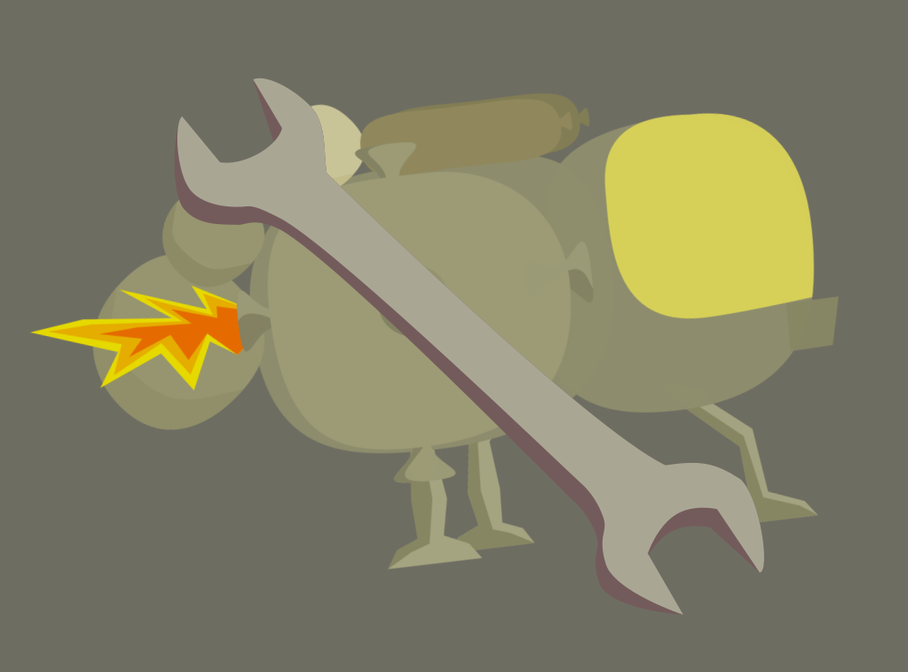

# AlphaFixes

# 

This plugin/mod helps fixing some issues that someone might encounter while playing the alpha of Outer Wilds.

The current issues that it solves are:

* Input being missread due to the game running at a frame rate that is too high
* OWAudioSource giving error while in the main menu

This plugin will generate a config file so you can customize the patches to fit your situation better.

If any issue that isn't covered by this mod happens to you, please open a [new issue](https://github.com/ShoosGun/AlphaFixes/issues/new?assignees=&labels=fix+request&template=alpha-fix-request.yml&title=%5BFix+Request%5D%3A+) in this repo and tell what is the problem, and how it is happening.
